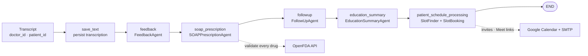

<div align="center">

# Pulse

**An agentic clinical assistant that turns a consultation transcript into
documentation, prescriptions, follow-ups and patient education — in one pass.**


</div>

---

## The problem

Clinical documentation is the tax doctors pay on every consultation. Notes must be
written, prescriptions drafted and checked, follow-ups scheduled, and patients sent home
with something they can actually understand. Each step is mechanical, and each one is a
place where something gets dropped.

Pulse takes the raw doctor–patient conversation and runs it through a **LangGraph state
machine** where each node is a specialist agent. One transcript in, a complete clinical
packet out.

## Pipeline

The main graph runs six nodes in sequence, threading a shared `AgentState` through each:



| Node | Agent | What it produces |
|:--|:--|:--|
| `save_text` | — | Transcript persisted and linked to doctor + patient |
| `feedback` | `FeedbackAgent` | Clinical questions the doctor missed during the consult |
| `soap_prescription` | `SOAPPrescriptionAgent` | SOAP note + draft prescription, every medication validated against OpenFDA |
| `followup` | `FollowUpAgent` | Suggested timeframe, visit type (in-person/telehealth), condition and reason |
| `education_summary` | `EducationSummaryAgent` | Plain-language summary written for the patient |
| `patient_schedule_processing` | `PatientSlotFinderAgent`, `PatientSlotBookingAgent` | Slot recommendation and booking, with confirmation email |

A seventh agent, `ChatbotAgent`, runs outside the graph as a `create_openai_functions_agent`
executor with tools for schedule lookup, appointment confirmation and Tavily-backed
medical Q&A.

## What makes it more than a prompt chain

- **Prescriptions are checked, not trusted.** Medications are extracted from the LLM draft
  with combined LLM guidance and regex, then each one is validated against the **OpenFDA**
  database. A structured validation report is appended to the prescription rather than
  silently correcting it — the doctor stays in the loop.
- **Scheduling actually happens.** Booking writes to the database, generates a Google Meet
  link for telehealth visits, and sends confirmation email over SMTP.
- **Deduplicated by design.** Follow-ups are keyed on consultation ID so a re-run of the
  graph cannot double-book a patient.
- **Prompts are versioned as code.** Every agent's prompt lives in `app/prompts/`, separate
  from the agent logic.

## Architecture

```
FastAPI/
  app/
    agents/      7 agents — feedback, SOAP, follow-up, education, chatbot, slot finder/booking
    graph/       LangGraph state machines — main, education_summary, patient_schedule
    api/         Route handlers per domain
    crud/        Database access layer
    models/      SQLAlchemy ORM models
    schemas/     Pydantic schemas, including AgentState
    prompts/     Prompt templates, one module per agent
    core/        Config and the shared LLM client
    utils/       Email helper
Streamlit/       Six-page operator UI over the API
docker-compose.yaml
```

## Stack

| Layer | Choice |
|:--|:--|
| Orchestration | LangGraph (`StateGraph`) |
| LLM | OpenAI GPT-4o via LangChain `ChatOpenAI` |
| API | FastAPI |
| Frontend | Streamlit (6 pages) |
| Database | PostgreSQL + SQLAlchemy |
| Validation | Pydantic |
| Drug safety | OpenFDA API |
| Web search | Tavily |
| Calendar | Google Calendar API |
| Email | SMTP |
| Deployment | Docker + docker-compose |

## Quick start

```bash
git clone https://github.com/Asik-Ifthaker-Hamim/Pulse.git
cd Pulse
docker compose up --build
```

FastAPI serves on `:8000` (`/docs` for the OpenAPI explorer), Streamlit on `:8501`.

Running the services directly instead:

```bash
cd FastAPI     && pip install -r requirements.txt && uvicorn main:app --reload
cd ../Streamlit && pip install -r requirements.txt && streamlit run app.py
```

### Configuration

Set these before starting — see `FastAPI/app/core/config.py`:

| Variable | Purpose |
|:--|:--|
| `OPENAI_API_KEY` | GPT-4o access |
| `TAVILY_API_KEY` | Medical web search tool |
| `DATABASE_URL` | PostgreSQL connection string |
| `SMTP_*` | Confirmation email (Gmail app password works) |
| Google credentials | Calendar API client for Meet links |

### Try it

`FastAPI/doctor_patient_conversation.txt` is a sample transcript. Post it to
`/api/langgraph/text-transcription` with a `doctor_id` and `patient_id` to run the
full graph.

## Key endpoints

| Endpoint | Purpose |
|:--|:--|
| `POST /api/langgraph/text-transcription` | Run the full consultation graph |
| `POST /api/langgraph/generate-education-summary` | Patient education summary only |
| `POST /api/chatbot` | Doctor-facing assistant with tools |
| `POST /api/patients/register`, `/api/doctors/register` | Profile registration |
| `POST /api/schedule/doctor-availability` | Publish available slots |
| `POST /api/schedule/recommend-slot`, `/book-slot` | Recommend and book |

## Status

Research and portfolio project. **Not cleared for clinical use** — it is not a medical
device, has not been validated against any regulatory standard, and every output is
intended for review by a qualified clinician.

## Author

**A.M. Asik Ifthaker Hamim** — Associate AI Engineer, Liberate Labs
[Portfolio](https://asik-ifthaker-hamim.netlify.app/) ·
[Google Scholar](https://scholar.google.com/citations?hl=en&user=0VYBJUsAAAAJ) ·
[ORCiD](https://orcid.org/0009-0006-6361-6277)
